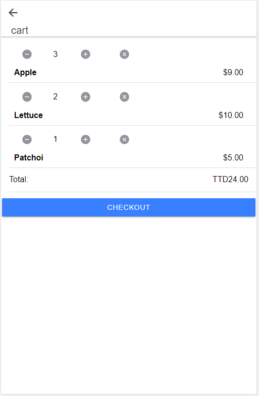

# Parsley
Parsley is an progressive web app built with Ionic, Capacitor and Firebase. It is a fully functional e-commerce app.
 
 
 

## Features
* Google Authentication
* Phone Authentication
* Geolocation tracking
* Cart service

## Setup
> npm install  

> ionic serve

## Upcoming Features
* Paypal checkout
